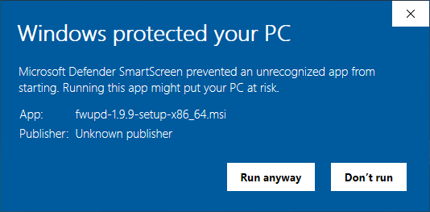
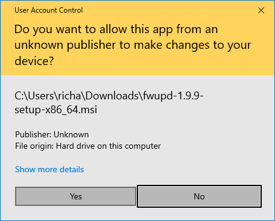
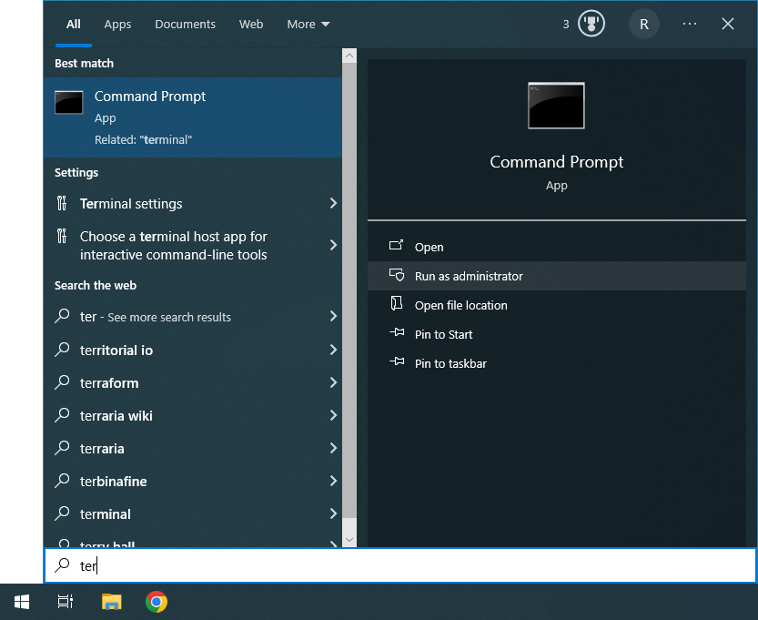
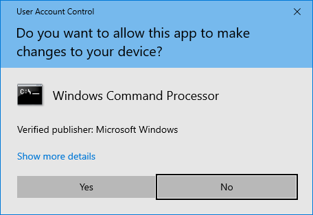
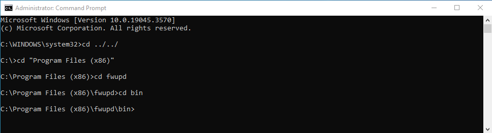
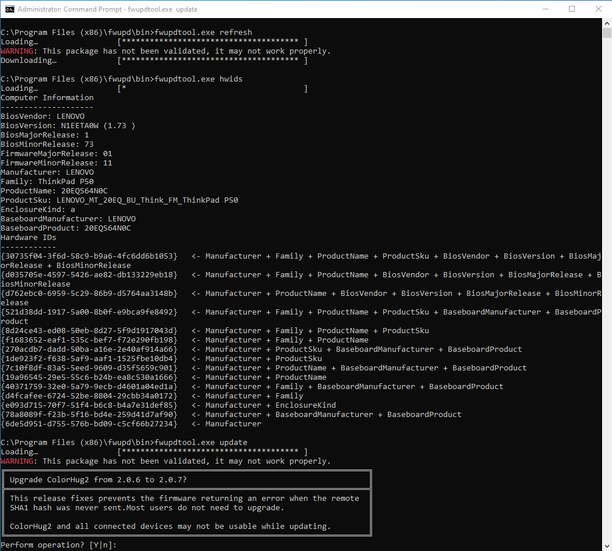

## Introduction

The Windows MSI package is built automatically in continuous integration.
Only some plugins are included, any plugins that use Linux-specific features like `udev`, `efivarfs` or `devfs` are disabled.
However, some USB devices updatable in Linux are also updatable in Microsoft Windows and macOS too.

## Installation

First, install the `.msi` package from the [release announcements](https://github.com/fwupd/fwupd/releases/), or any of the CI artifacts such as `dist/setup/fwupd-1.9.10-setup-x86_64.msi`.

Then click **More info** and **Run anyway** buttons:

If not already an administrator, click "yes" on the User Account Control (UAC) dialog:

There are currently no start menu or desktop installed, although this is something we want to add in the future.
In the meantime, use the start menu to open a *Command Prompt* and then make sure to click the **Run as an administrator** link:

Then click **yes** on the next UAC dialog:

Then navigate to `C:\Program Files (x86)\fwupd\bin`

Then `fwupdtool.exe` can be used just like `fwupdtool` on Linux or macOS.

Note: the `fwupd.exe` process also works, but no authentication is required.
You can use another (non-administrator) Command Prompt window to run `fwupdmgr.exe` just like on Windows.

There is no dbus-daemon on Windows, and so any D-Bus client should also then connect to TCP port 1341 rather than resolving the well-known `org.freedesktop.fwupd` bus name.
